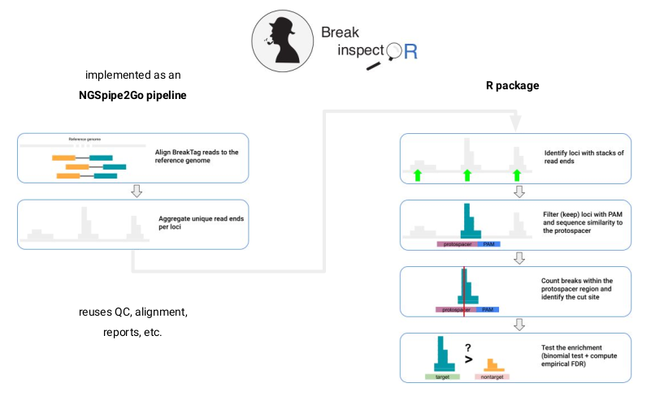
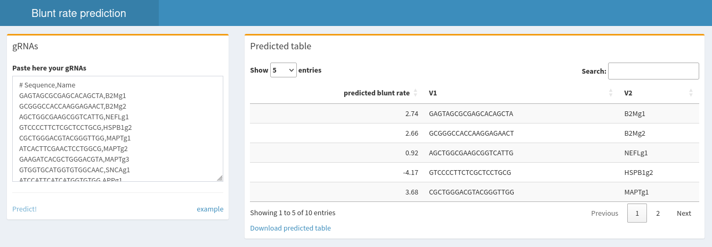

# BreakTag pipeline
Here we provide the tools to perform paired end or single read BreakTag raw data processing. The pipeline is also valid for (s)BLISS data. As input files you may use either gzipped fastq-files (.fastq.gz) or mapped read data (.bam files). In case of paired end reads, corresponding fastq files should be named using *.R1.fastq.gz* and *.R2.fastq.gz* suffixes. 
Some steps of the pipeline are based on the [blissNP pipeline](https://github.com/BiCroLab/blissNP) developed at the BriCo lab for BLISS data.

## Overall description



### Initial preprocessing

Initial preprocessing is typically done in a linux cluster using the [Breaktag pipeline](https://github.com/roukoslab/breaktag). It includes the following steps:

1. scanning for reads (single- or paired-end) containing the expected 8-nt UMI followed by the 8-nt sample barcode in the 5' end of read 1.
2. alignment of reads to reference genome with BWA, with a seed length of 19 and default scoring/penalty values for mismatches, gaps and read clipping.
3. reads mapped with a minimum quality score Q (defaults to Q=60) are retained.
4. close spatial consecutive reads within a window of 30 nucleotides and UMI differing with up to 2 mismatches are considered PCR duplicates and only one is kept.
    
The resulting reads are aggregated per position and reported as a BED file.
    
### breakinspectoR analysis

This R package implements the identification of CRISPR (currently, Cas9 only) targets and estimation of the scission profile. Additionally it provides several plotting functions to graphically summarize the results.

## Installing the pipeline
### Docker installation
This repository contains a `Dockerfile` which can be used to create a Docker image with all dependencies.
This is the preferred and easiest way to have all the dependencies satisfied and run the pipeline.

### Manual installation

Install and make available in the path the following dependencies:
- Bpipe
- Bedtools
- BWA
- FastQC
- MultiQC
- Samtools
- Several unix standard tools (perl5, python3, awk, etc.)

If you're running the pipeline in a cluster, you probably want to edit the [tools config file](https://github.com/roukoslab/breaktag/blob/main/config/tools.groovy) and tell the pipeline how these tools are loaded (added in \$PATH).

## Running the pipeline

Tools are expected to be in the PATH. From the root of the folder where you clone the [breaktag pipeline](git@github.com:roukoslab/breaktag.git):

- edit the parameters file `breaktag/pipelines/breaktag/essential.vars.groovy`
- edit the targets file `breaktag/pipelines/breaktag/targets.txt`
- softlink these 2 files to the root folder `ln -s breaktag/pipelines/breaktag/essential.vars.groovy . && ln -s breaktag/pipelines/breaktag/targets.txt .`
- run the pipeline with this command (eg. from within the docker container):
```sh
bpipe run -n256 breaktag/pipelines/breaktag/breaktag.pipeline.groovy rawdata/*.fastq.gz
```

## Pipeline-specific parameter settings (files you need to setup in order to run the pipeline):

- `targets.txt`: tab-separated txt-file giving information about the analysed samples. The following columns are required
  - name: sample name. Experiment ID found in fastq filename: expID_R1.fastq.gz
  - pattern: UMI+barcode pattern file used in the linker

- essential.vars.groovy: essential parameters describing the experiment
  - ESSENTIAL_PROJECT: root folder of the analysis
  - ESSENTIAL_SAMPLE_PREFIX: sample name prefix to be trimmed in the results
  - ESSENTIAL_THREADS: number of threads for parallel tasks
  - ESSENTIAL_BWA_REF: path to bwa indexed reference genome
  - ESSENTIAL_PAIRED: either paired end ("yes") or single read ("no") design
  - ESSENTIAL_QUALITY: minimum mapping quality desired

### breaktag ESSENTIAL VARIABLES

Important parameters are included in this file. They're distributed in several sections.

#### General parameters

```groovy
ESSENTIAL_PROJECT="/project/folder"
ESSENTIAL_SAMPLE_PREFIX="" 
ESSENTIAL_THREADS=16
```

#### Mapping parameters

```groovy
ESSENTIAL_BWA_REF="/ref/index/bwa/hg38.fa"  // BWA index of the reference genome
ESSENTIAL_PAIRED="yes"        // paired end design
ESSENTIAL_QUALITY=60          // min mapping quality of reads to be kept. Defaults to 60 (discarding multimappers and low quality mapping)
```

#### Other

You probably don't need to touch these lines:

```groovy
// further optional pipeline stages to include
RUN_IN_PAIRED_END_MODE=(ESSENTIAL_PAIRED == "yes")

// project folders
PROJECT=ESSENTIAL_PROJECT
LOGS=PROJECT + "/logs"
MAPPED=PROJECT + "/mapped"
QC=PROJECT + "/qc"
RAWDATA=PROJECT + "/rawdata"
REPORTS=PROJECT + "/reports"
RESULTS=PROJECT + "/results"
TMP=PROJECT + "/tmp"
TRACKS=PROJECT + "/tracks"
TARGETS=PROJECT + "/targets.txt"
```

More fine-grained tunning of the tools called by the pipeline can be controled from the `.header` files in the `breaktag/modules` folder.

### Targets file

A tab-separated file with the filenames (excluding the .fastq.gz extension) and the breaktag barcode and the position of the UMI within the read.

```sh
name	pattern	umi
FANCF_rep1	^(........)(.TCACACGT|C.CACACGT|CT.ACACGT|CTC.CACGT|CTCA.ACGT|CTCAC.CGT|CTCACA.GT|CTCACAC.T|CTCACACG.)	$1
FANCF_rep2	^(........)(.TCACACGT|C.CACACGT|CT.ACACGT|CTC.CACGT|CTCA.ACGT|CTCAC.CGT|CTCACA.GT|CTCACAC.T|CTCACACG.)	$1
NT_rep1	^(........)(.TCACACGT|C.CACACGT|CT.ACACGT|CTC.CACGT|CTCA.ACGT|CTCAC.CGT|CTCACA.GT|CTCACAC.T|CTCACACG.)	$1
NT_rep2	^(........)(.TCACACGT|C.CACACGT|CT.ACACGT|CTC.CACGT|CTCA.ACGT|CTCAC.CGT|CTCACA.GT|CTCACAC.T|CTCACACG.)	$1
```

## bluntPred

For your set of gRNAs, you may want to run the prediction of blunt rates of Streptococcus pyogenes Cas9 (SpCas9) using the XGBoost model trained with HiPlex1 data.



### Dependencies

The main dependency is [H2O](https://h2o.ai/).

Remove any previously installed H2O packages for R.

```R
if ("package:h2o" %in% search()) { detach("package:h2o", unload=TRUE) }
if ("h2o" %in% rownames(installed.packages())) { remove.packages("h2o") }
```

Download packages that H2O depends on.

```R
install.packages(c("RCurl","jsonlite", "devtools"))
```

Download and install the H2O package for R. The models were trained on H2O version 3.36.1.2, therefore specifically install this version.

```R
install.packages("h2o", type="source", repos="http://h2o-release.s3.amazonaws.com/h2o/rel-zumbo/2/R")
```

Test the H2O installation with:

```R
library(h2o)
localH2O = h2o.init()
demo(h2o.kmeans)
```

Now, it's all set to install the package.

The package resides in GitHub only. You will probably need `devtools` for that (`install.packages("devtools")`).

```R
devtools::install_github("roukoslab/bluntPred")
```

### Run

Open the web app in your R console:

```R
bluntPred::shiny_bluntPred()
```

Paste a list of gRNAs targets and click on `Predict`.
The list can actually be a table with \<tab\> or \<comma\> separated fields.
The gRNA sequence is expected to be in the *first* column.

NOTE: Only the seed portion of the protospacer (this is, the last 10 nucloetides of the target sequence) are used for the prediction in this model.

## Cite

If you find this tool useful and use it in your research, please cite our publication:

Longo, Sayols et al., Linking CRISPR–Cas9 double-strand break profiles to gene editing precision with BreakTag. Nat. Biotechnol. 2024. DOI: https://doi.org/10.1038/s41587-024-02238-8
